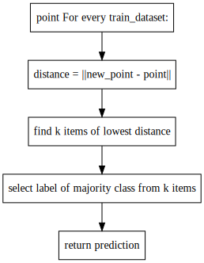
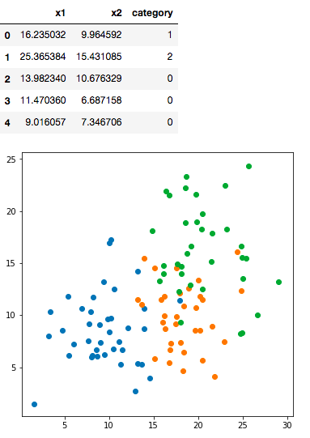
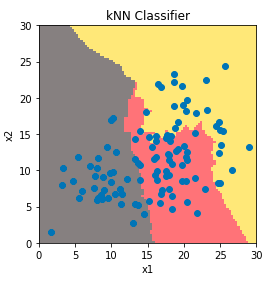

# k-최근접 이웃 (kNN : k-Nearest Neighbors)
=========================================

## Overview
- 지도학습 (Supervised Learning)

| 장점                 | 단점                      |
|:--------------------:|:-------------------------:|
|        정확도        |      메모리와 계산량      |
| 선입견과 가정이 없음 | 기존 훈련용 데이터에 의존 |
| 이상치에 영향이 적음 |                           |
| 훈련과정이 불필요함  |                           |

## 거리 측정을 기준으로 분류
-------------------------

k-최근접이웃 분류방법은 기존에 훈련용 데이터 집합과 항목(labels)을 새로운 데이터와 비교하여 가장 근접한 항목으로 분류하는 방법이다. 가장 근접한 항목을 k개수만큼 선정한 뒤 다수결을 통해 분류항목을 결정한다.

## 일반적 알고리즘
---------------

-	새로운 데이터 X에 대해 kNN 알고리즘을 사용한 분류방법은 다음과 같이 나타낼수 있다.

```
point For every train_dataset:
    distance = ||new_point - point||
    find k items of lowest distance
    select label of majority class from k items
    return prediction
```

## 기본예제 1
----------

-	기존항목(labels) : 3개의 라벨 (0~2)
-	데이터(properties) : (x1, x2)





```py
# 분류기 생성
def knn_classifier(new_x, k, dataset=df.values[:,:-1], labels=df.values[:,-1]):
    # 새로운 점부터 다른 지점까지에 거리 계산 (유클리드 거리계산법)
    n_dataset = dataset.shape[0]
    dist = ((np.tile(new_x, (n_dataset,1)) - dataset)**2).sum(axis=1)**(0.5)
    # 가장 짧은 거리 k개수 선정
    shortest_arg = dist.argsort()[:k]
    count={}          
    for i in shortest_arg:
        label = int(labels[i])
        count[label] = 1 + count.get(label,0) # initialize and increment at the same time
    major_label = sorted(count.items(), key=operator.itemgetter(1), reverse=True)[0][0] # sort by reverse
    return major_label
    # 선정된 라벨을 이용해 다수결로 최종결정
```

### 시각화 :

데이터는 x1과 x2에 의해 분류될수 있으며, 그래프상 임의에 점을 주어졌을때에 분류 결과를 보여줌.


