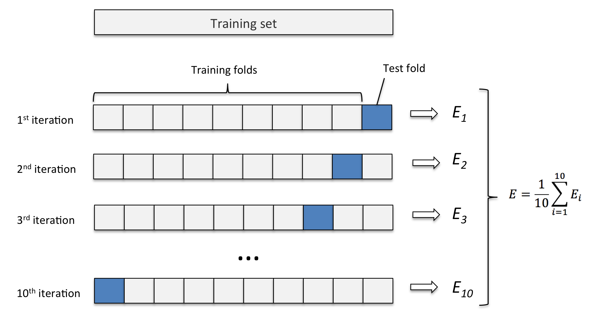

# k-fold 교차검증 (k-fold cross validation)
https://github.com/rasbt/python-machine-learning-book

k-fold 교차검증은 해당 러닝 방식의 성과와 정확도를 측정하는 도구가 될수있다. 또한 적당한 파라미터를 찾아내는데 기준이 될수있다.

## 목표
머신러닝의 최종 목표는 주어진 데이터를 최대한 정확하게 처리하는것이다. 때문에 대부분의 알고리즘은 오류율로 성능을 평가받게 되고 되도록이면 오류율을 낮추는 방향으로 여러 파라미터를 조율하게된다. 하지만 가장 큰 문제점은 주어진 데이터의 양이다. 받아들일수 있는 모든 데이터를 가지고 알고리즘을 트레이닝할 수 있다면 좋겠지만, 보통 주어진 데이터는 한정적이고 과연 이 데이터가 모든 가능성을 대표하는지에 대한 문제가 발생한다.

### 과적합
예를 들어, 주어진 데이터를 가지고 한없이 오류율이 낮아지도록 조율을 할 경우, 주어진 데이터에 대한 처리는 정확해질 수 있지만 새로운 데이터를 다룰때 크게 성능이 저하되는 현상이 있다. 이러한 과적합 현상은 단순히 오류율을 낮추도록만 트레이닝을 할 경우 자주 발생하며, 머신러닝 모델을 만들때 가장 많이 고려해야되는 문제점이다.

### 데이터셋 분리방법
1차적으로 이러한 문제를 해결하는 방안은, 주어진 데이터를 어느정도의 일정 비율만 가지고 트레이닝을 한 뒤, 나머지 데이터를 가지고 오류율을 체크하는것이다. 이 방법은 트레이닝에 사용되지 않은 데이터가 들어왔을때 머신러닝 알고리즘이 얼마나 잘 판단을 하는지를 판단해준다.

### 분리방법의 한계
데이터셋을 오류체크용과 트레이닝용으로 나누는 방법은 트레이닝 과정중 오류율을 측정하는 방법으로는 문제가 없지만, 여전히 최적의 파라미터를 조율하는데는 적합하지 않다. 예를들어 오류체크용으로 마련해둔 테스트 데이터셋의 오류를 최소화한다고 가정한다면, 이번에는 테스트 세트에 과적합되는 현상이 생기기 때문이다. 결과적으로 머신러닝의 정확성을 측정하기 위해서는 다른 방법이 필요하다.

## 확인용 데이터셋
k-fold 교차검증은 단순하게 말하면 데이터셋을 여러개(k)로 나눈 뒤 각각 데이터 블록을 가지고 에러율을 확인하는 과정이다. 최종 에러는 k개의 블록을 이용한 모든 에러율의 평균치를 사용한다.
