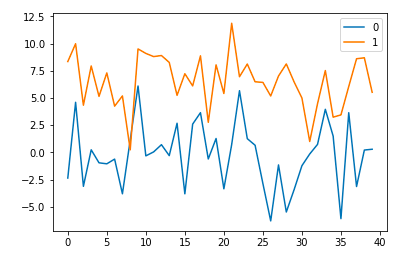
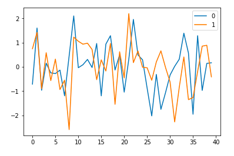
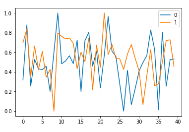

# 수치형 데이터 정규화 (Normalization)

- 두가지 이상에 다른 속성값을 비교하거나 이용하기 위해 규칙을 가지고 데이터를 다듬는 과정

## 평균/표준편차를 이용한 선형 방식

$$
x^* = \frac{x - \mu}{\sigma} \\
x \Rightarrow \text{original data}, \, x^* \Rightarrow \text{normalized data} \\
\mu \Rightarrow \text{mean}, \, \sigma \Rightarrow \text{standard deviation}
$$

## 최대/최소를 이용한 선형 방식

$$
x^* = \frac{x - \min}{\max-\min} \\
x \Rightarrow \text{original data}, \, x^* \Rightarrow \text{normalized data}
$$

