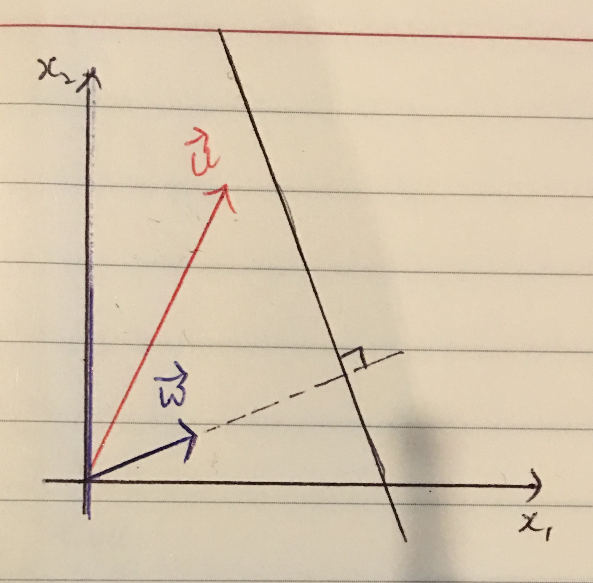
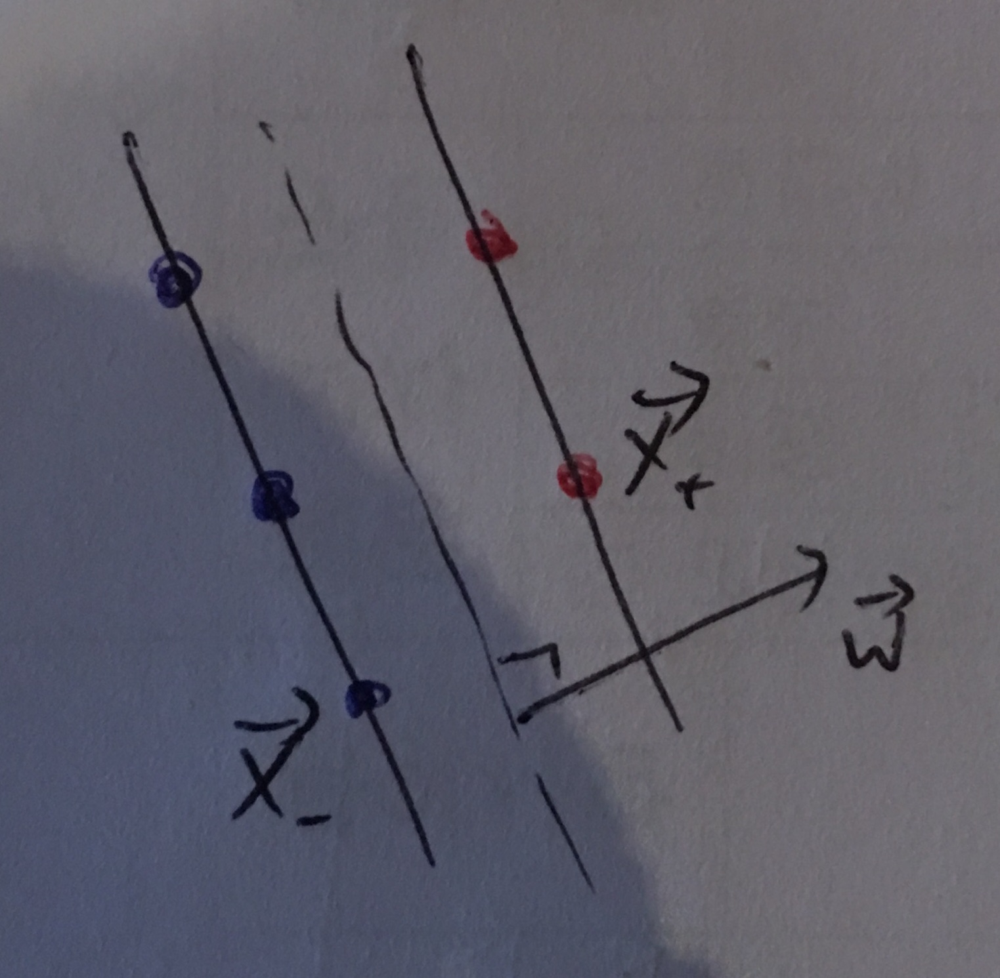

# 지지벡터 머신(Support Vector Machine, SVM)

## 지지벡터 머신 역사와 이론

지지벡터 머신은 상당히 짧은 역사를 가지고 있습니다. 이론을 확립하고 제시한 사람이 아직도 살아계시니 말이죠. 그럼에도 불구하고 아마 지지벡터머신은 현재 가장 많은 분야에서 적극적으로 사용되고 있는 테크닉입니다. 그 이유는 지지벡터 머신 특유의 안정성과 신뢰성, 그리고 다양성 때문입니다. 거의 모든 머신러닝의 과제(회귀와 분류)를 모두 뛰어난 수준으로 처리 가능하며, 여러가지 트릭을 사용해 비선형 모델에도 적용 가능합니다. 지도학습의 방법으로도 쓰이지만 지지벡터 클러스터링을 통해 비지도학습에도 사용될 수 있습니다. 로지스틱 회귀, 혹은 그와 관련된 퍼셉트론이나 딥러닝과 비교했을때도 구현하는데 훨씬 적은량의 노력이 필요하고 계산량도 크게 차이가 없습니다. 무엇보다 강한 장점은 높은 수준의 최적화를 기대할 수 있다는 점이지요. (이것은 SVM 이 Convex 형태의 최적화 모델을 가지고 있기 때문입니다.)

이러한 지지벡터 머신의 구조는 어느날 어느 수학자에게 단순하게 떠오른게 아닙니다. 그렇다보니 그 이론도 사실 그렇게 간단하지 않습니다. Vladimir N. Vapnik 이 지지벡터 머신을 생각해내는 그 절차적인 순서 흐름을 따라가야 이해가 되고 왜 지지벡터 머신이 우연이면서도 아름답고, 왜 강력한 머신러닝 도구가 되었는지를 이해할 수 있습니다.

우선 가장 기본적인 지지벡터 머신의 이론을 보도록 하겠습니다.

### 1. 판정방법 (Decision Rule)

분류기란 쉽게말해 임의의 객체(object)에 대한 여러 속성(properties)을 주어졌을때 그 객체를 하나의 항목(class)로 분류하거나 혹은 각각 항목에 속할 확률을 찾아내주는 매커니즘을 말합니다. 예를들어 위와 같은 그림의 데이터를 주어졌을때, 분류기의 역할은 임의의 점을 주어졌을 때 그 위치에 있는 객체는 빨간 내모인지 파란 동그라미일지를 찾아낸다고 보면 됩니다. 결정적인 방법이든 확률적인 방법이든 서로 다른 머신러닝 방법들은 각각 다른 분류 방법을 가지고 있습니다.

지지벡터 머신의 분류 방법은 하나의 선 (hyperplane) 을 기준으로 합니다. 이 선은 두 데이터셋을 가로질러 전체 공간을 이분하는 역할을 합니다. 지지벡터 머신이 제안하는 가장 최선의 이분법은, 두 데이터 사이에 공간, 혹은 마진이 최대한이 되는 이분법을 최적의 이분선으로 지향하고 있습니다. 위의 그림을 보면 최적의 선이 최대의 마진을 가질 수 있게 파란색과 빨간색을 이분하고 있습니다. 만약 주어진 새로운 점의 위치가 저 마진보다 위쪽에 위치한다면 파란색, 아래쪽에 위치한다면 빨간색이라 분별할 수 있습니다. (아직 그 사이에 점들은 생각하지 않겠습니다.)

만약 데이터셋이 이분할 수 없는 형태를 띄고 있을때를 비선형적 구조라 하는데, 이러한 비선형 모델로 전환하는 방법은 나중에 설명하겠습니다. 최선의 이분선에 유일성 또한 나중에 다루도록 하겠습니다.

이 판정 법칙을 수식으로 나타내보겠습니다. 지금까지는 저 선을 하나의 선형방정식으로 나타내었는데, 이번에는 조금 다른 방법을 사용해볼까 합니다. 비록 지금은 2차원 선상에 있지만, 다차원 상에 하이퍼평면을 쉽게 나타내는 방법은 바로 평면의 수직 벡터를 찾는것입니다. (지지벡터라고 부르는 이유입니다.) 수직벡터와 하나의 위치 백터만 있다면 그 두 벡터로 다차원 위에 평면을 나타낼 수 있습니다. 거기에, 만약 수직벡터의 시작점을 중앙 ($\vec{0}$)에 둔다면 하나의 벡터만으로도 평면을 나타낼 수 있겠지요. 이 벡터를 $\vec{w}$ 라 하겠습니다.

단순한 2차원 그래프에선 다음과 같은 그림이 됩니다.

벡터 $\vec{w}$의 길이에 대해서는 나중에 찾아보도록 하겠습니다. 지금은 이 벡터가 단순하게 분류선을 직교하는 벡터라 하겠습니다.

여기서, 임의의 점인 $\vec{u}$ 를 주어졌다고 생각해봅시다. 그렇다면 우리는 이 미지의 데이터가 얼마나 분류선과 가까운지를 계산해야합니다. 다르게 말하자면, 벡터 $\vec{u}$ 에는 얼마나 많은 $\vec{w}$ 방향이 포함되어있는지를 찾아야합니다. 두 벡터의 내적을 구하면 쉽게 알수 있습니다.

이를 사용해 우리는 기준을 만들 수 있습니다. 임의의 데이터인 $\vec{u}$ 가 지지선의 위쪽 혹은 아래쪽에 위치하는것을 판단하는 기준은 다음과 같이 나타낼 수 있습니다.

$$
\begin{aligned}
    \vec{w} \cdot \vec{u} \geq c \\
    \boxed{\vec{w} \cdot \vec{u} + b \geq 0}
\end{aligned}
$$

$\vec{u}$ 가 위의 식을 만족하면 점이 분류선을 기준으로 위쪽에 위치한다는 것을 정의할 수 있습니다. 반대로 저 식을 만족하지 못한다면 분류선을 기준으로 아래쪽에 위치한다고 판별할 수 있겠죠. 이로서 우리는 임의의 데이터를 공간에 어느쪽에 위치하는지를 판단할 수 있습니다.

### 2. $||\vec{w}||$ 와 b 에 대해서

위의 기준을 사용하려면 두가지 값을 찾아야합니다. $||\vec{w}||$ 는 수직벡터의 길이를 나타내고, b는 내적으로부터 지지선까지 얼마나 떨어져 있는지를 나타내는 값이라 할 수 있습니다. 이 두 값을 어떻게 조율하냐에 따라 지지선의 위치와 기울기가 결정된다고 볼 수 있겠지요.

우선, 하나의 가정을 할까 합니다. 이 가정을 통해 $||\vec{w}||$ 와 b 사이에 관계를 구성할 수 있습니다. 우선 다음과 같은 데이터가 있다고 생각해보겠습니다.

데이터는 2가지 종류로 구분지어져있습니다. 편의를 위해 마이너스(-)항목과 플러스(+) 항목의 데이터를 주어졌다고 생각합니다. $x_-$ 는 마이너스 항목의 데이터중 정확히 마진선 위에 위치하는 점들이라 하겠습니다. 반대로 $x_+$ 는 플러스 항목의 데이터중 반대쪽 마진선에 위치한 점들이라 생각하면 됩니다.

만약 우리가 위의 점처럼 마진선 위에 존재하는 데이터를 분류기에 넣었을 경우 어떤 결과가 나올까요? 사실 분류기는 마진에 대해 아무런 제약이 없습니다. 때문에 우리는 마진선 위에 점은 분류기에 다음과 같은 결과를 낸다고 가정하겠습니다.

$$
\begin{aligned}
\vec{w}\cdot\vec{x}_+ + b &= 1 \\
\vec{w}\cdot\vec{x}_- + b &= -1
\end{aligned}
$$

이 두 식은 다음과 같이 간단하게 나타낼 수 있습니다.

$$
\boxed{y_i(\vec{w}\cdot\vec{x}_i+b)-1=0
,\,\quad y_i=
    \begin{cases}
      1, & \text{for + samples}\\
      -1, & \text{for - samples}
    \end{cases}}
$$

위의 식은 $||\vec{w}||$ 와 b 사이에 하나의 제약(constraint)를 만들어줍니다.

### 3. 마진 극대화

지지벡터머신에서 분류선은 두 분류의 데이터를 최대의 마진을 가지고 나누는 선입니다. 그렇다면 이 마진은 어떻게 나타낼 수 있을까요? 어떻게 hyperparameter을 조정해야 최대의 마진을 가질 수 있을까요?

마진은 분류선 양쪽에 위치한 마진선 사이에 거리입니다. 이는 $x_-$ 와 $x_+$ 를 사용해 찾을 수 있습니다. 이 거리는 e로 나타내겠습니다.

$$
\begin{aligned}
e &= \frac{(\vec{x}_+ - \vec{x}_-)\cdot\vec{w}}{||\vec{w}||}
\end{aligned}
$$

$(\vec{x}_+ - \vec{x}_-)$ 는 두 마진선을 잇는 벡터입니다. 이 벡터의 수직성분이 마진(거리)라 할 수 있겠지요.

이 전에 우리는 $x_+$ 와 $x_-$ 에 대해 다음과 같이 정의했습니다.

$$
\begin{aligned}
\vec{w}\cdot\vec{x}_+ &= 1-b \\
\vec{w}\cdot\vec{x}_- &= -1-b
\end{aligned}
$$

이를 대입하면 마진은 단순하게 다음과 같은 식이 됩니다.

$$
\boxed{e=\frac{2}{||\vec{w}||}}
$$

다시말해, 마진을 극대화시키는 방향은 벡터 $\vec{w}$ 의 길이를 최소화하는것과 동일한 의미를 가진다고 말할 수 있습니다.

### 4. $||\vec{w}||$ 최소화

우선, 나중에 나올 수식을 단순화시키기 위해, 우리가 단순화하고자 하는 함수를 $||\vec{w}||$ 가 아닌 $\frac{1}{2}||\vec{w}||^2$ 라 하겠습니다. 거리를 최소화 시키는것과 거리의 제곱을 최소화시키는 것은 당연하게도 같은 효과를 낼겁니다.

우리는 어떠한 함수를 제약(constraint) 조건을 지키면서 극솟값(혹은 극대값)을 찾는 방법을 알고있습니다. 바로 미적분에 라그랑지안 승수(Lagrangian Multiplier)을 사용하는 방법이죠.

라그랑지안 승수에 대한 자세한 설명은 생략하겠습니다. 이에 대한 정보는 미적분학을 참고하시면 됩니다.

승수는 람다($\lambda$)로 나타내겠습니다.

$$
\begin{aligned}
L &= \frac{1}{2}||\vec{w}||^2 - \sum_i \lambda_i \left[y_i(\vec{w}\cdot\vec{x}_i + b)-1\right] \\
\nabla\cdot L &= 0, \quad \text{at extrema} \\
\nabla\cdot L &= \left(\frac{dL}{d\vec{w}},\frac{dL}{db}\right) \\
&= \left(\vec{w} - \sum_i\lambda_i y_i \vec{x}_i\,,\, \sum_i\lambda_i y_i\right)
\end{aligned}
$$

최소화 조건은 다음과 같습니다.

$$
\begin{aligned}
\vec{w} &= \sum_i\lambda_i y_i \vec{x}_i \\
0&=\sum_i\lambda_i y_i
\end{aligned}
$$

위의 두 식을 L 함수에 적용시켜 보겠습니다. 이 함수는 우리 분류기의 최적화 식이 됩니다.

$$
\begin{aligned}
L_{min} = \frac{1}{2}\left(\sum_i\lambda_i y_i \vec{x}_i\right)\left(\sum_j\lambda_j y_j \vec{x}_j\right) &- \sum_i \lambda_i y_i \vec{x}_i \cdot\left(\sum_j\lambda_j y_j \vec{x}_j\right) \\
&- \sum_i\lambda_i y_i b + \sum_i \lambda_i
\end{aligned}
$$

첫번째 항과 두번째 항은 같기때문에 하나의 항으로 합칠수 있습니다. $\sum_i\lambda_i y_i b$ 항은 $b\sum_i\lambda_i y_i$ 와 같고, 이는 최소화 조건에 의해 0이됩니다. 그렇다면 최적화식은 다음과 같습니다.

$$
\boxed{L_{min} = \sum_i \lambda_i - \frac{1}{2}\left(\sum_i\sum_j\lambda_i\lambda_j y_i y_j (\vec{x}_i\cdot\vec{x}_j)\right)}
$$

한가지 집고 넘어가야하는 사실은, 최적화에 필요한 조건은 주어진 데이터간에 내적($\vec{x}_i\cdot\vec{x}_j$)이라는 점입니다.

### 5. 정리

위에 계산들은 다음과 같은 식으로 정리됩니다.

$$
\begin{aligned}
\text{판단식}\quad &: \quad \vec{w}\cdot\vec{u}+b\geq 0 \\
& \boxed{\left(\sum_i \lambda_i y_i \vec{x}_i \cdot\vec{u}\right)+b \geq 0} \\
\text{최적화식}\quad &: \quad \boxed{L_{min} = \sum_i \lambda_i - \frac{1}{2}\left(\sum_i\sum_j\lambda_i\lambda_j y_i y_j (\vec{x}_i\cdot\vec{x}_j)\right)}
\end{aligned}
$$

위에서 말했듯이 최적화는 데이터 사이에 내적만으로 이루어져있습니다. 신기한점은 판단식 또한 주어진 데이터와 미지의 점의 내적만으로 판단이 가능합니다. 이는 지지벡터 머신에 중요한 특징입니다.

## 단순 예제

위의 식을 사용해 단순한 예제를 만들어보겠습니다.

## 비선형 모델과 커널트릭
