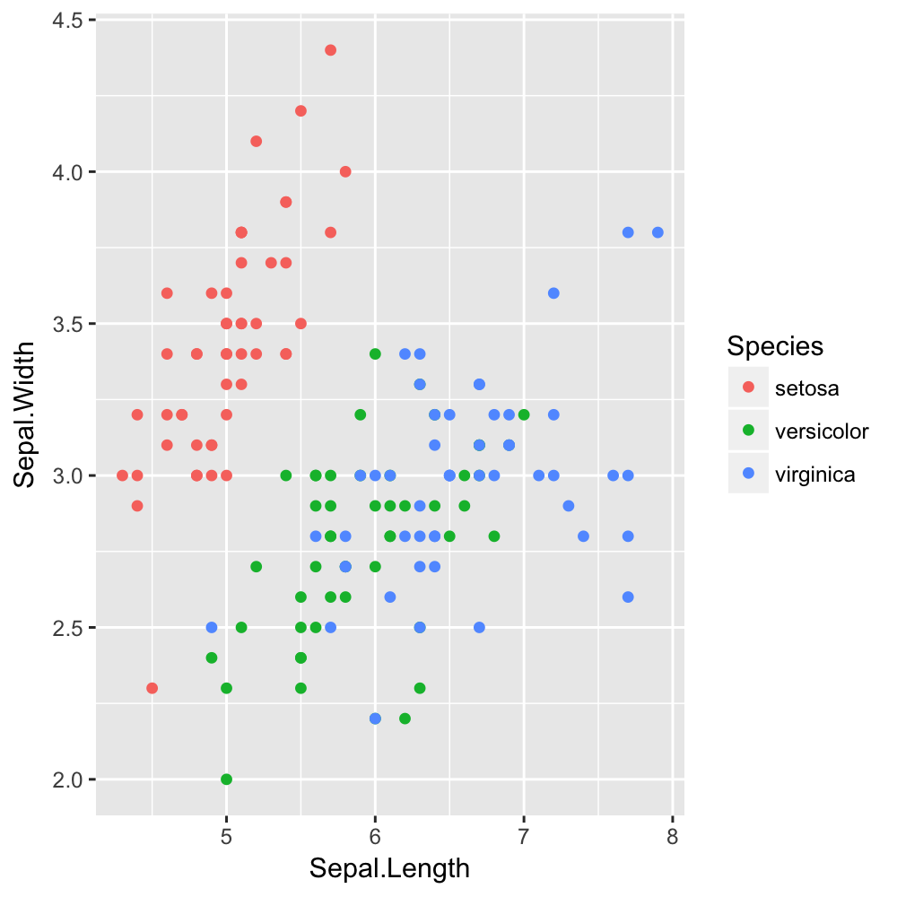
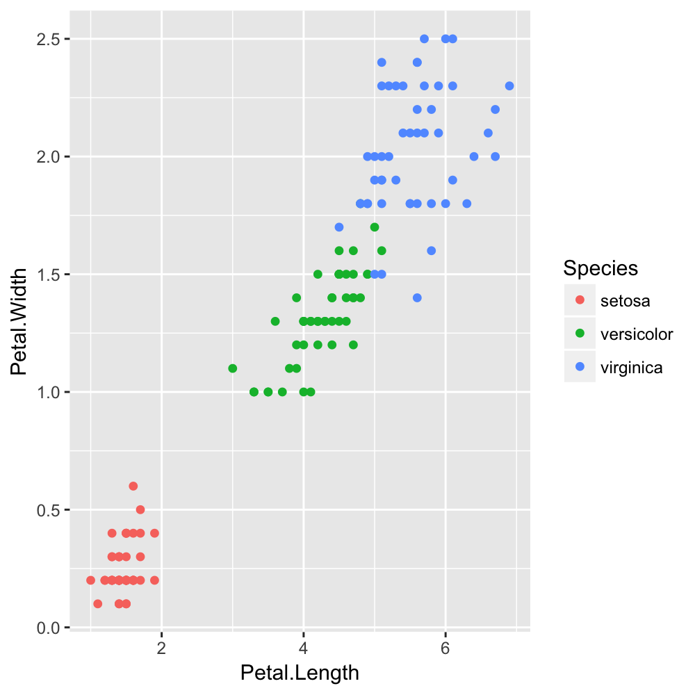

베이지안 확률이론
=================

결정론적 vs 확률론적(개연론적)
------------------------------

### 결정론적 데이터 분류와 그 한계

주어진 데이터를 분류할때 k-최근접이웃 방식은 미리 알고있는 데이터를 기반으로 어느쪽 특성과 가장 밀접한가를 판단합니다. 이러한 결정적인 분류 방식은 서로 다른 분류의 데이터가 확실하게 다른 특성을 가지고있다면 높은 빠른 시간과 높은정확도를 낼수 있지만, 데이터의 분류가 애매한 경우 예측률이 많이 감소하게 됩니다. 아이리스 꽃 분류의 예를 보겠습니다.

  - https://archive.ics.uci.edu/ml/datasets/iris - https://en.wikipedia.org/wiki/Iris_flower_data_set

아이리스 꽃 종류를 꽃잎(Sepal)으로 구분할 경우, 얼핏 봤을때 versicolor 분류와 virginica 분류가 명확하지 않다는 것을 알 수 있습니다. 이런 경우는 k-최근접이웃 방식으로도 크게 도움이 되지 않습니다. 반면 꽃받침(Petal) 데이터를 사용할 경우, 세가지 분류 모두 적당히 떨어져있기 때문에 명확한 분류가 가능합니다.

이러한 문제점의 근본적인 이유는 결정론적인 분류 방식에 있습니다. 꽃잎의 데이터만 주어졌을 경우, 100% 확률로 정답을 알아내기란 사실상 불가능합니다.

### 확률론적 접근

그렇다면 이러한 데이터를 토대로 의미가 있는 분석을 하려면 어떻게 해야될까요? 가장 쉬운 방법은 분류의 기대치를 낮추는 것입니다. 애초에 오류가 발생할 것을 당연하게 생각하고, 결정적인 분류(deterministic)가 아닌 확률적 분류(probabilistic)를 지향하는 것입니다.

예를 들어, 결정적인 분류 방식은 주어진 데이터 $\vec{x}$ 에 대해 한가지 답 $y$ 를 요구하지만, 확률적인 분류는 주어진 데이터에 대해 각 분류에 속할 확률 $\vec{p}=(p_0, p_1, \dots)$ 를 요구합니다.

나이브 베이스
-------------

가장 간단한 확률적 데이터 분류로 나이브 베이스를 알아보겠습니다. 나이브라는 이름은 이 방법이 여러가지의 가정을 토대로 사용되기 때문입니다.

### 조건부 확률

-	p(a) - a일 확률
-	p(a|b) - b 에 속한 a 의 확률
-	p(a and b) - a 와 b 의 확률

### 베이스 규칙(Bayes' rule) 과 분류방법

$$ p(c|x,\vec{y})=\frac{p(x,\vec{y}|c_i)p(c_i)}{p(x,\vec{y})} $$
