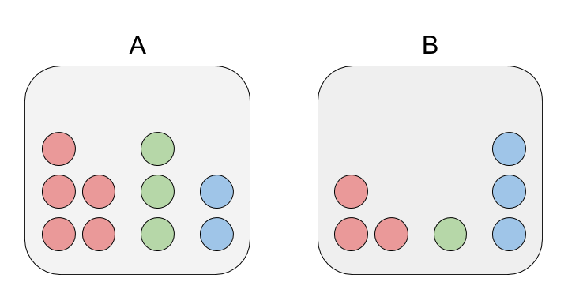
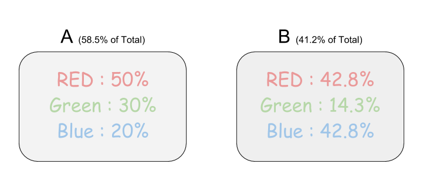

베이지안 확률이론
=================

결정론적 vs 확률론적(개연론적)
------------------------------

### 결정론적 데이터 분류와 그 한계

주어진 데이터를 분류할때 k-최근접이웃 방식은 미리 알고있는 데이터를 기반으로 어느쪽 특성과 가장 밀접한가를 판단합니다. 이러한 결정적인 분류 방식은 서로 다른 분류의 데이터가 확실하게 다른 특성을 가지고있다면 빠른 시간과 높은정확도를 낼수 있지만, 데이터의 분류가 애매한 경우 예측률이 많이 감소하게 됩니다. 아이리스 꽃 분류의 예를 보겠습니다.

  - https://archive.ics.uci.edu/ml/datasets/iris - https://en.wikipedia.org/wiki/Iris_flower_data_set

아이리스 꽃 종류를 꽃잎(Sepal)으로 구분할 경우, 얼핏 봤을때 versicolor 분류와 virginica 분류가 명확하지 않다는 것을 알 수 있습니다. 이런 경우는 k-최근접이웃 방식으로도 크게 도움이 되지 않습니다. 반면 꽃받침(Petal) 데이터를 사용할 경우, 세가지 분류 모두 적당히 떨어져있기 때문에 명확한 분류가 가능합니다.

이러한 문제점의 근본적인 이유는 결정론적인 분류 방식에 있습니다. 꽃잎의 데이터만 주어졌을 경우, 100% 확률로 정답을 알아내기란 사실상 불가능합니다.

### 확률론적 접근

그렇다면 이러한 데이터를 토대로 의미가 있는 분석을 하려면 어떻게 해야될까요? 가장 쉬운 방법은 분류의 기대치를 낮추는 것입니다. 애초에 오류가 발생할 것을 당연하게 생각하고, 결정적인 분류(deterministic)가 아닌 확률적 분류(probabilistic)를 지향하는 것입니다.

예를 들어, 결정적인 분류 방식은 주어진 데이터 $\vec{x}$ 에 대해 한가지 답 $y$ 를 요구하지만, 확률적인 분류는 주어진 데이터에 대해 각 분류에 속할 확률 $\vec{p}=(p_0, p_1, \dots)$ 를 요구합니다.

나이브 베이스
-------------

가장 간단한 확률적 데이터 분류로 나이브 베이스를 알아보겠습니다. 나이브라는 이름은 이 방법이 여러가지의 가정을 토대로 사용되기 때문입니다.

### 조건부 확률

Notation:

-	$p(a)$ - a일 확률
-	$p(a|b)$ - b 에 속한 a 의 확률
-	$p(a \cup b)$ - a 와 b 의 확률

Identities:

-	$p(c \cup x) = p(x|c)p(c) = p(c|x)p(x)$
-	$p(c|x) = \frac{p(x|c)p(c)}{p(x)}$
	-	베이스 룰 (Bayes' rule)

### 확률론적 분류방법

확률론적 분류의 결과는 보통 다음과 같은 벡터로 나타냅니다.

$$ p(c_i|\vec{v}) $$

쉽게 말해, 여러가지 특성 $\vec{v}$ 을 주어졌을때, $c_i$ 에 속할 확률을 나타냅니다. 예를 들어, A와 B 상자안에 빨간색, 초록색, 파란색 구슬이 들어있다고 가정해봅시다.

만약 누군가가 무작위의 상자에서 구슬을 꺼냈더니 빨간색 구슬이 나왔다고 합니다. 이 상황에서 우리는 정확히 어느 상자에서 빨간색 구슬이 나왔는지를 특정할 수 없습니다. 최선의 방법은 이 구슬이 각 상자에서 나올수 있는 확률을 찾는것입니다.

확률을 계산할 때 고려해야될 사항이 두가지가 있습니다.

1.	A 상자에서 꺼냈을 확률과 B 상자에서 꺼냈을 확률 $p(\text{box A}),\quad p(\text{box B})$
2.	상자 안에서 빨간색 구슬이 선택됬을 확률 $p(\text{red|box A}),\quad p(\text{red|box B})$

$$\begin{aligned} p(\text{box A} | \text{red}) &= \frac{p(\text{red|box A})p(\text{box A})}{p(\text{red})} \\&= \frac{\frac{5}{10}\frac{10}{17}}{\frac{8}{17}} \\&= \frac{5}{8} \approx 62.5\% \\ p(\text{box B}|\text{red}) &= \frac{p(\text{red|box B})p(\text{box B})}{p(\text{red})}\\&= \frac{\frac{3}{7}\frac{7}{17}}{\frac{8}{17}} \\&= \frac{3}{8} \approx 37.5\%\end{aligned} $$

비록 빨간 구슬이 A 상자에서 나왔을 가능성이 더 높지만, 그렇다고 확정적인 결론 내릴 수는 없습니다. 실제로 이러한 방법이 활용될 때는 최종 결정을 위한 한가지 룰이 더 필요합니다. 대표적으로 쓰이는 방법은 다음 두가지가 있습니다.

1.	argmax - 가장 높은 확률로 분류
2.	weighted random selection - 즉석 무작위 선정을 통해 분류

사실 이 문제는 조금더 간편한 방법으로 해결할 수 있습니다. '빨간 구슬이 A 상자에 속할 확률' 을 구하는데에는 A의 빨간 구슬과 모든 빨간 구슬의 비율만 구하면 되기 때문이죠. 하지만 이러한 확률적인 계산을 하는것은 여러모로 도움이 됩니다. 보통 큰 사이즈의 데이터를 분석할 때는 그 데이터의 통계(확률)만 주어진 상태로 분류를 해야되기 때문입니다.

### 베이스 규칙(Bayes' rule)

위에 예제를 조금 다른 상황으로 바꿔보겠습니다.

이번에는 각 상자에 있는 구슬 개수가 나와있지 않지만, 각 색깔에 대한 통계가 주어졌습니다. 조금더 복잡한 상황을 고려해봅시다.

만약 누군가가 둘중 하나의 상자에서 무작위로 3개의 구슬을 빼내었더니, 빨간색 구슬 1개, 초록색 구슬 1개, 파란색 구슬 1개가 나왔습니다. 그렇다면 과연 어느 상자에서 구슬을 빼낸것일까요? (상자 안의 구슬의 개수는 아주 많기 때문에, 3개를 빼내어도 비율은 크게 변하지 않는다고 가정합니다.)

이 문제 역시 결정적인 답을 내놓을 수는 없습니다. 그렇기 때문에 역시 확률론적인 방법을 사용해야합니다.

베이스 규칙은 다음과 같이 나타낼 수 있습니다.

$$ p(c_i|x)=\frac{p(x|c_i)p(c_i)}{p(x)} $$

이 규칙을 적용해보겠습니다. 우리가 찾아야 하는 값은 다음과 같습니다.

$p(\text{box A}|(1,1,1)) = p(\text{box A}|\text{red})p(\text{box A}|\text{green})p(\text{box A}|\text{blue}) $ $p(\text{box B}|(1,1,1)) = p(\text{box B}|\text{red})p(\text{box B}|\text{green})p(\text{box B}|\text{blue})$

먼저, 공통적으로 들어가는 값을 체크해둡니다.

-	$p(\text{box A}) = 0.585$
-	$p(\text{box B}) = 0.412$
-	$p(\text{red}) = (0.5*0.585) + (0.428*0.412) = 0.469$
-	$p(\text{green}) = (0.3*0.585) + (0.143*0.412) = 0.234$
-	$p(\text{blue}) = (0.2*0.585) + (0.428*0.412) = 0.293$

그다음, 확률을 계산해줍니다.

$$\begin{aligned} p(\text{box A}|(1,1,1)) &= p(\text{box A}|\text{red})p(\text{box A}|\text{green})p(\text{box A}|\text{blue}) \\&= \left(\frac{0.5 * 0.585}{0.469}\right)\left(\frac{0.3 * 0.585}{0.234}\right)\left(\frac{0.2 * 0.585}{0.293}\right) \\&= 0.1868\end{aligned} $$

$$\begin{aligned} p(\text{box B}|(1,1,1)) &= p(\text{box B}|\text{red})p(\text{box B}|\text{green})p(\text{box B}|\text{blue}) \\&= \left(\frac{0.428 * 0.412}{0.469}\right)\left(\frac{0.143 * 0.412}{0.234}\right)\left(\frac{0.428 * 0.412}{0.293}\right) \\&= 0.0570\end{aligned} $$

결과적으로, 구슬들을 A상자에서 꺼냈을 확률이 B상자에서 꺼냈을 확률보다 3배가량 더 높다고 결론지을 수 있습니다..
