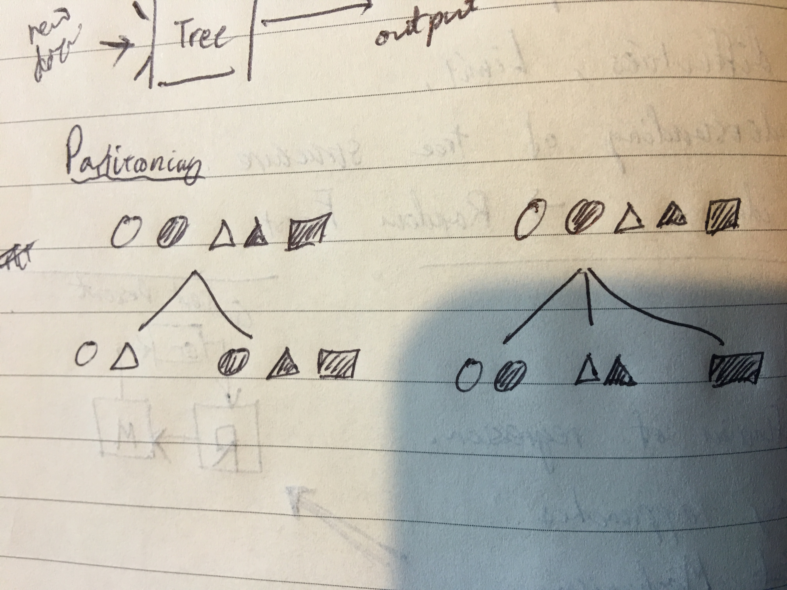

# 의사결정 트리

의사결정 트리는 데이터 간에 규칙과 특징을 분류해 놓은 하나의 구조물입니다. 이러한 구조는 새로운 데이터를 주어졌을때 빠르고 직관적으로 어느 분류에 속하는지를 찾아낼 수 있습니다.

의사결정 트리는 데이터간에 반복적인 규칙과 연관성이 많으면 많을수록 사이즈가 작아지게 되있습니다. 예를들어 데이터를 N가지 항목중 하나로 분류하고싶다면 질문해야 하는 최대갯수는 $\log_2 N$ 개가 되는데, 이는 많은 데이터을 매우 효율적으로 관리할 수 있다는 것을 보여줍니다. 예를 들어 '스무고개'를 생각해보면, 친구끼리 생각해낼 수 있는 대부분의 사물은 20개의 질문 안에 하나로 특정되어집니다.

그렇다면 이런 의사결정 트리를 어떻게 활용할 수 있을까요?

## 트리 설계과정

먼저, 트리를 만들기 위한 데이터를 수집합니다. 우리는 주어진 데이터를 효율적으로 분류할 수 있는 트리를 구성한 뒤, 새로운 데이터를 가지고 트리가 얼마나 잘 분류해내는지를 판단할 것입니다.

트리를 설계하는 과정은, 다른 머신러닝 방법들의 학습(training)에 해당하는 부분입니다. 대략적으로는 먼저 데이터를 서로 구분할 수 있는 특징을 가지고 트리에 가지들을 생성할 것입니다. 이 과정을 '분기'(partitioning)과정이라 합니다. 그 다음, 필요없다고 판단되어지는 가지나 너무 모호한 특징들에 의해 과다하게 공간을 차지하는 가지들을 쳐내는 과정을 '가지치기'(pruning)이라 합니다.

### 1. 분기 (partitioning)

대량의 데이터 집합을 주어졌을때, 한가지 특징을 가지고 두 종류의(혹은 다수의) 부분집합으로 나누는 과정입니다.

왼쪽 그림을 보면, 분류를 위해 사용된 특징은 '도형 안의 색'입니다. 결과적으로 5개의 도형을 2개의 흰색도형과 3개의 검은 도형 집합으로 나눌수 있습니다. 반면, 오른쪽의 그림을 보면 분류를 위해 사용된 특징은 '도형의 모양'입니다. 이번에는 2개의 동그라미, 2개의 세모, 1개의 네모로 나눌 수 있었습니다.

여기서 잠깐 생각해봐야 할 것은 어떤 데이터를 주어졌을때 분기를 나눠야 하는 최대 횟수는 얼마나 될까 입니다. 당연하게도, 분기를 나누는 횟수가 적으면 적을수록 트리는 간소화되고 결정을 내리는 속도도 빨라질 수 있습니다. 이론적으로 만약 각 데이터 간에 아무런 공통점이 없다면, N개의 데이터를 분류하는데 필요한 분기횟수는 N-1개입니다. 매우 비효율적이죠. 하지만 만약 데이터를 큰 맥락으로 나눌 수 있는 특징이 많다면, 분기 횟수 또한 줄어들 수 있습니다. 의사결정 트리를 구성하는데 가장 중요한 것은, 바로 이런 '분할의 효율'을 극대화 시키는 것입니다. 이에 대해서는 이후에 좀더 세부적으로 설명하겠습니다.

분기 과정에서 또 한가지 재미있는점은, 바로 '재귀'적인 요소입니다. 위의 그림처럼 어떠한 특징을 사용해 데이터셋을 분류했다면, 그 다음 해야할 일은 다시 각각 소분류를 더 세부적으로 분류하는 일입니다. 이 과정은 사실 이 전에 했던 과정과 똑같습니다. 다만 이번에는 모든 데이터를 사용하지 않고 일부분의 데이터만을 사용하는 것 뿐이죠. 이러한 재귀적인 속성은 트리를 구성하는 알고리듬을 훨씬 간략하게 만들어줍니다.

### 2. 가지치기 (pruning)

[wikipedia](https://en.wikipedia.org/wiki/Pruning_(decision_trees))

가지치기 과정은 분기를 나누는 것보다는 조금더 세밀하고 복잡한 과정입니다. 가지치기 과정의 중요한 목표는 다음과 같습니다.

- 과적합 방지
	- 예측정확도 증가
- 트리의 공간 감소
- 계산량 감소

머신러닝을 활용할 때 가장 먼저 떠오르는 문제는 바로 '과적합' 문제입니다. 우리는 항상 기억해야 하는것은, 모든 머신러닝의 최종 목표는 '미지'의 데이터를 최대한 정확하게 분류해내는 것입니다. 하지만 머신러닝을 학습시키는 과정은 '미지'의 데이터가 아닌 '분류된' 데이터를 가지고 만들어냅니다. 이 과정은 근본적인 문제를 만들어내는데, 그게 바로 과적합입니다. 다시말해 주어진 데이터를 잘 분류하는것과 미지의 데이터를 잘 분류하는 것은 다릅니다. 이를 해소하는 방법중 하나는, 어느정도에 오류율을 허용하는 것입니다. 의사결정 트리의 세부적인 가지들을 하나로 병합함으로써 비록 주어진 데이터에 대한 분류 오류율은 높아지더라도 미지의 데이터에 대한 예측정확도를 증가시킬 수 있습니다.

가지치기는 트리의 가지들을 병합하는 과정이다보니 트리의 사이즈를 감소시키고, 결정 과정 또한 줄여주는 효과가 있습니다. 보통의 머신러닝 방식들은 효율과 정확성중 하나를 선택해야되는 경우가 많습니다. 가지치기는 정확성을 줄이는 대신 효율을 높이는 일인데, 특이하게도 의사결정 트리는 그 구조상 높아지는 오류율에 비해 낮아지는 계산량과 공간이 훨씬 크다는 장점이 있습니다. 약간의 오류율을 댓가로 큰 효과를 내는것도 의사결정 트리의 큰 장점중 하나입니다.

## 정보량, 명확성

분기를 나누는 방법의 기준을 살펴보도록 하겠습니다. 의사결정 트리는 데이터를 효율적으로 관리하는데는 최고를 자랑하지만, 그 한계도 명확합니다. 그 이유는 트리를 구성하는 일이 그만큼 복잡하고 어쩔때는 비효율적이기 때문입니다.

행맨 게임을 할때, 우리는 a,e,o처럼 자주 들어갈 수 있는 글자를 먼저 떠올리게 됩니다. 이는 당연하게도 영어 단어중 대부분의 단어에 모음이 들어가게 되어있고, 이를 통해 얻을 수 있는 정보량이 많기 때문입니다.

의사결정 트리를 구성할 때 가장 중요한것이 바로 이 '정보량'입니다. 행맨이나 스무고개같은 게임을 할 때 처음에는 세부적인 질문보다 큰 맥락을 물어보게 됩니다. '생물이야?' 라고 물어보는게 '다리가 2개야?'라고 물어보는 것보다 더 유리한 이유는 '다리가 2개야?'라는 질문을 통해 얻을 수 있는 정보가 더 적기 때문입니다. 흔히 말하는 가지치기라고 하는 작업이죠. 그렇다면 이 정보량의 기준은 뭐가 되어야할까요? 효율적인 가지치가란 무엇을 말하는 것일까요?

정보량의 증가(information gain)를 머신러닝에서는 동질성(homogeneity)의 증가, 혹은 불확실성(uncertainty)의 감소라고 합니다. 쉽게 말해, 분류된 정보들은 서로가 더 명확한 관계가 있어야 한다는 것입니다. 트리를 구성할 때 이러한 동질성을 나타내는 지표중 가장 대표적인 3가지를 살펴보겠습니다.

### 엔트로피 (Claude Shannon's Entropy)

-	[wikipedia](https://en.wikipedia.org/wiki/Entropy_\(information_theory)\)

$$ {H} (X)=\sum_{i=1}^{n}{P} (x_{i})\,{I} (x_{i})=-\sum_{i=1}^{n}{P} (x_{i})\log_{b}P(x_{i}) $$

엔트로피라는 단어는 항상 어렵게 느껴지는 단어일 수 있는데, 그 이유는 아마 쓰이는 상황에 따라 의미가 조금씩 다르기 때문일것입니다. 열역학, 물리학, 통계학, 화학 등 여러 분야에서 사용되는 단어로써, 뭔가의 불순성, 불확실성, 렌덤성 등의 의미를 내포하고 있는데, 공통적으로는 시스템의 복잡도가 올라간다고 볼 수 있습니다.

여기서 엔트로피가 '정보량'을 의미하는 이유는, 데이터가 통일되어있을때보다는 복잡하게 연관되있을 때 더 많은 정보를 포함한다고 보기 때문입니다. 의사결정 트리를 구성하는데 주로 사용되는 엔트로피의 정의는 셰넌 엔트로피를 사용합니다.

위의 그림을 살펴보도록 하겠습니다. 원래의 데이터는 총 5개의 서로 색깔 혹은 모양이 다른 도형들입니다. 아무런 분류를 하지 않았을때의 (셰넌)엔트로피는 다음과 같습니다.

$$
\begin{aligned}
	H(X) &= -\sum_{i=1}^{n}{P} (x_{i})\log_{b}P(x_{i}) \\
	&= 5*(-\frac{1}{5}\log_{2}\frac{1}{5}) \\
	&\approx 2.3219
\end{aligned}
$$

이번에는 왼쪽 그림처럼, 색깔을 기준으로 분류해봅시다. 전체 엔트로피를 구하는법은, 각 분류별로 엔트로피를 구한 다음 합을 구하는것입니다.

$$
\begin{aligned}
	\sum H(X) &= \sum_{c\mid\text{color}}P(c)\left( -\sum_{i=1}^{n}{P} (x_{i})\log_{b}P(x_{i}) \right)\\
	&= \frac{2}{5}\left(2*(-\frac{1}{2}\log_{2}\frac{1}{2})\right) + \frac{3}{5}\left(3*(-\frac{1}{3}\log_{2}\frac{1}{3})\right) \\
	&\approx 1.3510
\end{aligned}
$$

마찬가지로, 오른쪽 그림처럼 모양으로 분류해봅시다.

$$
\begin{aligned}
	\sum H(X) &= \sum_{s\mid\text{shape}}P(s)\left( -\sum_{i=1}^{n}{P} (x_{i})\log_{b}P(x_{i}) \right)\\
	&= \frac{2}{5}\left(2*(-\frac{1}{2}\log_{2}\frac{1}{2})\right) + \frac{2}{5}\left(2*(-\frac{1}{2}\log_{2}\frac{1}{2})\right) + \frac{1}{5}\left(-\log_{2}1\right) \\
	&\approx 0.8
\end{aligned}
$$

엔트로피 값은 데이터의 불순도를 의미함으로 값이 낮아질수록 불순도가 낮아지고 정확도가 높아진다는것을 의미합니다. 즉 전체의 데이터를 색깔과 모양으로의 분류를 비교해보면, 둘 다 데이터의 순도가 증가한다는 것을 볼 수 있지만, 모양으로 분류하는 방법이 색깔로 분류하는 방법보다 더 증가량이 크다고 말할 수 있습니다.

이는 의사결정 트리를 구성하는데 좋은 지표가 됩니다. 트리에서 분할을 하는데에 어떤 특징을 기준으로 할지, 스무고개를 할 때 어떤 질문을 할지, 행맨을 플레이할 때 어떤 알파벳을 먼저 물어볼지를 결정할 때 이러한 방법을 사용하면 효율적으로 분류/결정과정을 실행할 수 있습니다.

### 지니계수 (Gini index)

-	[wikipedia](https://en.wikipedia.org/wiki/Gini_coefficient)

### 오차 (Misclassification error)

## 간단한 예제

## 장단점

### 장점

-	분류(classification)와 예측(prediction) 두가지 모두 가능하다.
-	결과에 대해 이해하기가 직관적이다.
-	복잡한 데이터를 간편하게 정리할 수 있다.
-	다른 머신러닝 방법들과 동시에 활용 가능하다.

### 단점

-	데이터의 특성상 트리 구조로 나타내기 힘든 경우가 있다.
-	오류에 대한 처리가 불명확하다.
-	확장성이 떨어진다.
	-	한번 트리를 구성할 경우, 새로은 데이터를 가지고 확장하고 싶을 때 처음부터 다시 설계해야한다.
-	비선형적 모델링에 적합하지 않다.
-  과적합을 방지하기 위해 많은 실험와 노력을 요구한다.
