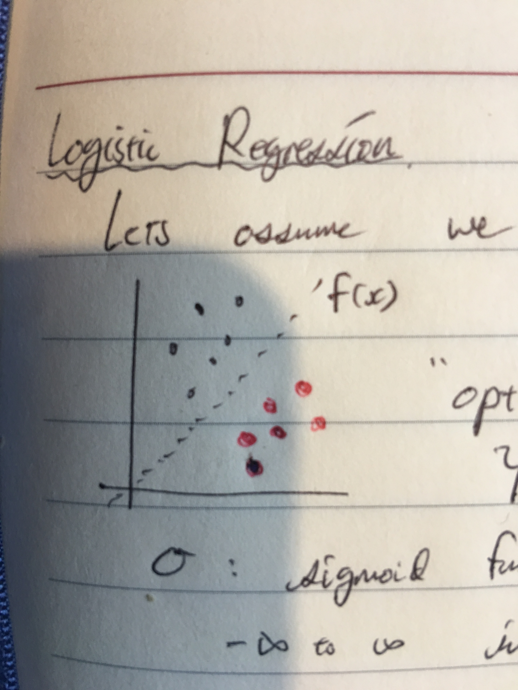
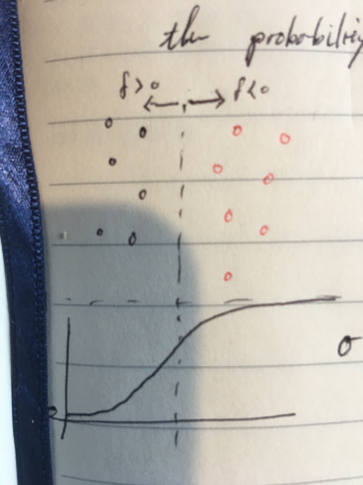

# 회귀

지금까지는 나이브베이스나 k-근접이웃같은 방법을 통해 주어진 데이터를 기반으로 새로운 데이터를 구별해냈습니다. 이들은 공통적으로 확률적, 그리고 결정적인 방법으로 새로운 데이터가 어느 항목에 더 밀접한지를 찾아내는 방법을 사용해왔습니다. 잠시 이러한 접근법을 미뤄두고, 이번에는 조금 다른 접근을 통해 분류법을 만들어보고자 합니다.

회귀를 가지고 분류를 할때는 주어진 데이터를 직접적으로 이용하지 않고, 데이터들의 패턴 분석을 우선적으로 합니다. 이러한 방법은 데이터의 특징과 항목 사이에 규칙을 알아낸다는 장점이 있고, 어떤 미지의 데이터를 주어주더라도 빠른 결과를 낼 수 있는 장점이 있습니다. 반면 데이터 사이에 명확한 관련성이나 패턴이 존재하지 않거나, 옳바르지 않은 패턴을 사용해 분석했을 경우 높은 오류율을 낼 수 있습니다. 분류과정이 빠른 만큼 정확한 분류 방식을 찾아내는게 더 어려운 방법입니다.

데이터를 기반으로 하는 분류법의 단점중 하나는 어떠한 형태로든 원본의 데이터 혹은 그 데이터에 대한 통계자료를 저장하고 있어야 한다는 것입니다. 이는 당연하게도 데이터의 량이 방대해질수록 분류법 또한 무거워진다는 단점이 있습니다. 회귀법은 많은 데이터를 하나의 모델로 추정하고, 그 모델이 최대한 데이터를 정확하게 반영하도록 설계하기때문에 훨씬 가볍습니다. 하시만 그만큼 모델을 찾아내고 설계하는 일이 복잡하고 어쩔때는 모델이 더 무거워질 수도 있습니다.

## 특징

| 장점 | 단점 |
|:---:|:---:|
|극한의 데이터에 대해 결과를 낼 수 있다. | 이상치에 대해 민감하게 반응한다  |

회귀(Regression)이란 기본적으로 특징-결과 사이에 규칙성, 혹은 관계를 찾아내는 과정입니다. 머신러닝 뿐만 아니라 다양한 분야에서 어떠한 데이터를 가지고 통계적인 모델링을 할때 사용되는 대표적인 방법입니다.

다음과 같은 그래프를 자주 볼 수 있습니다. 빨간색 점들은 2가지 다른 변수에 의해 나타낼 수 있는데 데이터를 표기한 것이고, 파란색 선은 이 두가지 변수 사이에 어떠한 관계를 나타내고 있습니다. 이러한 관계를 찾아낸다면, 우리는 수치형 값을 예측할 수 있는 강력한 도구를 가지게 되는 샘입니다. 이러한 '예측'이 주된 목적이 되기도 하지만, 또다른 의미는 과연 두가지 다른 변수가 얼마나 서로 밀접한 관계가 되어있는지를 판단하는 일입니다. 이는 데이터가 찾아낸 회귀 모델 주변에 얼마나 밀집되어있는지로 판단할 수 있습니다.

회귀법을 사용하는 방법은 크게 세가지로 나눠질 수 있습니다. 첫번째 단계는 모델링입니다. 이는 우리가 다루고있는 데이터들의 특징들 사이에 관계(relation)를 먼저 예측해보는 일입니다. 두번째 단계는 우리가 예측한 모델을 주어진 데이터를 가장 잘 나타내도록 맞추는 일입니다. 이 과정을 트레이닝(training), 피팅(fitting), 러닝(learning)등으로 불립니다. 마지막으로, 새로운 미지의 데이터를 우리가 만든 모델에 사용하는 일입니다.

## 회귀의 종류

회귀는 모델과 용도에 따라서 종류가 다양하게 변합니다. 데이터를 반영하는 모양에 따라 선형회귀, 다항회귀, 지수회귀 등으로 불리며, 데이터와 회귀모델 사이에 거리를 측정해 모델을 평가할수 있습니다. 회귀모델을 정했다면, 이 거리를 좁혀나가는 방식으로 최적화합니다. 물론 여러 모델을 동시에 선택해 어느 모델이 더 적합한지를 판단할 수도 있습니다.

먼저, 가장 기본적인 회귀법인 선형회귀를 살펴본 뒤, 머신러닝에 사용되는 로지스틱 회귀를 설명하겠습니다.

## 선형회귀

다음과 같은 데이터를 주어주고, 이 데이터에 가장 알맞는 선형 모델을 찾아보도록 하겠습니다.

|x|y|
|:--:|:--:|
|1   | 1  |
|2   | 1  |
|3   | 2  |

선형회귀는 다음과 같은 식을 가집니다.

$$
f(x)=ax+b
$$

그렇다면 우리는 a와 b를 조절해 위의 식이 데이터를 가장 잘 나타내도록 만들어야 합니다.

데이터 위치를 보면 세 점 모두를 하나의 선으로 나타낼 수는 없습니다. 그렇다면 과연 무엇을 기준으로 우리가 '최적합'한 선을 찾을 수 있을까요? 가장 직관적인 기준은 거리입니다. 세 점부터 선까지의 거리가 가장 짧을때 선이 가장 적합하다고 말할 수 있습니다.

선으로부터 세 점까지의 거리는 다음과 같이 나타낼 수 있습니다.

$$
\begin{aligned}
\text{dist}(x) &= |f(x) - y| \\
\text{dist}^2(x) &= \left(f(x)-y\right)^2
\end{aligned}
$$

거리는 단순히 선부터 점까지의 거리지만, 절대값을 구하는 과정을 제곱을 구하는 과정으로 대체할 수 있습니다. 거리를 최소화 하는 문제와 거리의 제곱을 최소화 하는 문제의 결과는 동일합니다.

$$
\begin{aligned}
    \vec{\text{dist}} &= (f(\vec{x})-\vec{y})^2\\
    &= \left(
    \begin{bmatrix}
            ax_1+b\\
            ax_2+b\\
            ax_3+b
    \end{bmatrix}
    -
    \begin{bmatrix}
            y_1\\
            y_2\\
            y_3
    \end{bmatrix}
    \right)^2 \\
    &= \left(
    \begin{bmatrix}
            1a+b\\
            2a+b\\
            3a+b
    \end{bmatrix}
    -
    \begin{bmatrix}
            1\\
            1\\
            2
    \end{bmatrix}
    \right)^2\\
    &= \begin{bmatrix}
    (a+b-1)^2 \\
    (2a+b-1)^2 \\
    (3a+b-2)^2
    \end{bmatrix}\\
    &= \begin{bmatrix}
    a^2 + 2 a b - 2 a + b^2 - 2 b + 1 \\
    4 a^2 + 4 a b - 4 a + b^2 - 2 b + 1 \\
    9 a^2 + 6 a b - 12 a + b^2 - 4 b + 4
    \end{bmatrix}
\end{aligned}
$$

총 거리의 합은 $14 a^2 + 12 a b - 18 a + 3b^2 - 8 b + 6$입니다. 이 식의 최소값은 $(a,b)=\left(\frac{1}{2},\frac{1}{3}\right)$ 이기 때문에, 최적의 선형 회귀모델은

$$
y=\frac{1}{2}x + \frac{1}{3}
$$

과 같이 나타낼 수 있습니다.

## 로지스틱회귀

회귀는 위와 같이 먼저 데이터를 표현해주는 식을 정한 뒤, 그 식에 데이터를 맞추는 방식으로 진행됩니다. 즉, 모든 회귀법은 모델링과 모델의 최적화 과정을 정하는걸로 시작합니다. 이 두가지를 어떻게 정하느나에 따라 회귀법을 다양한 방식으로 응용할 수 있습니다.

로지스틱 회귀는 이항분류기입니다. 다르게 말하자면, 데이터를 두가지 항목으로 분류할 수 있다는 말입니다. 만약 데이터를 두가지 이상의 항목으로 분류하고자 한다면, 로지스틱 회귀를 여러번 중첩해서 사용해야합니다. 또한, 로지스틱회귀는 주로 선형 모델을 기반으로 하기때문에, 비선형 모델을 사용하고싶다면 역시 여러번 중첩해서 사용해야합니다. 예를 들어, 다음 아이리스 꽃 종류를 꽃잎 길이와 넓이에 따라 나타낸 그래프를 살펴보도록 하겠습니다.

그래프를 보면 setosa 종류의 아이리스 꽃이 왼쪽 위에 밀집되어있는 것을 발견할 수 있습니다. 만약 우리가 꽃잎의 길이와 넓이를 주어지고, 이 꽃이 setosa 종류인지 아닌지를 판별하고 싶을때, 로지스틱 회귀를 사용할 수 있습니다.

편의를 위해, 길이(length)는 $x_1$이라 하고, 넓이(width)는 $x_2$라 하겠습니다. 데이터들은 $(\vec{x},t)$ 형식으로 주어지는데, $\vec{x}$ 는 길이와 넓이를 나타내는 벡터이고, t는 이 데이터가 setosa 종에 속하는지(1) 속하지 않는지(0)를 나타냅니다.

### 회귀모델과 의미

로지스틱 회귀의 모델은 선형회귀와 같이 일반 선형식을 기반으로 합니다. 다만 주어지는 데이터가 2차원이 아닌 다차원일 수 있다는 점에서, 조금더 일반화된 식을 사용하도록 하겠습니다.

$$
f(\vec{x}) = a_0 + a_1x_1 + a_2x_2 + ...
$$

이 식은 다음과 같이 데이터를 두가지 분류로 나누는 경계선이라 할 수 있습니다.

최적화 방법을 생각해보기에 앞서, 모델의 왼쪽 항인 $f(\vec{x})$ 에 의미를 조금 살펴보도록 하겠습니다. 위와 같은 2차원의 데이터셋을 모델에 넣어보면 $f(\vec{x})=a_0+a_1x_1+a_2x_2$ 와 같은 식이 됩니다. 만약 여기서 f의 값이 무엇을 의미하는 것일까요?

만약 $f(\vec{x})=0$ 이라면, 그 뜻은 데이터의 점 위치가 정확히 선 위에 있다는 것을 의미합니다. 그렇다면 만약 값이 점점 더 커지거나, 혹은 작아진다면 그것은 무엇을 의미할까요?

로지스틱 회귀는 바로 이런점을 이용해서 데이터를 이항분류하는 작업입니다. f값이 $\infty$ 를 향해 더 커진다는 의미는 점의 위치가 선으로부터 점점 더 위쪽으로 멀어진다는 의미고, f값이 $-\infty$ 를 향해 작아질수록 점의 위치가 선의 아래쪽으로 멀어진다는 의미입니다.

이런점을 이용해 어떠한 분류선이 얼마나 제대로 분류작업을 해내는지를 평가할 수 있습니다.

### 최적에 의미와 최적화 방법

이제 이 모델을 최적화하는 방법을 생각해보도록 하겠습니다. 선형회귀법은 모델을 데이터에 '최적합'하도록 만들고싶을때는 짧은거리를 기준으로하여 데이터들이 최대한 선 주변에 밀집되도록 만들었습니다. 하지만 이번에는 거리가 아닌 '분류'가 기준이 되어야합니다.

그렇다면 거리가 아닌 어떠한 다른 기준이 필요합니다. '분류작업'을 얼마나 잘 해내는지를 평가할 수 있는 기준이 필요하고, 그 값을 토대로 최적에 분류선을 찾아내는 과정이 바로 최적화 과정입니다.

#### 활성화 함수 (Sigmoid)

하나의 데이터 $(\vec{x},t)$ 를 주어졌을때 이 데이터를 어떠한 분류기 $\phi(\vec{x})$ 에 넣었다고 한다면, 이 데이터가 얼마나 잘 분류를 해내는지는 다음과 같이 나타낼 수 있습니다.

$$
\phi(\vec{x}) - t
$$

이 함수의 특징을 단순하게 표현하자면 $\vec{x}$ 라는 데이터를 주어졌을 때, 이 데이터가 선 위에 위치하는지, 아래에 위치하는지를 판별해주는 함수입니다. 그런 작업을 해주는 함수가 하나 있습니다.

$$\sigma(x)={\frac{e^{x}}{e^{x}+1}}$$

위의 시그모이드 함수를 보면, $-\infty$ 부터 $\infty$ 사이에 값을 0부터 1사이에 값으로 변환해주는 함수입니다. 이를 이용한다면, 선으로부터 위쪽 혹은 아래쪽으로 멀리 떨어져 있을수록 0 혹은 1에 가까운 값을 반환하는 식을 구성할 수 있습니다.

$$
\sigma\left(f(\vec{x})\right) = \sigma(a_0 + a_1x_1 + a_2x_2)
$$

시그모이드 함수의 장점은 만약 데이터의 위치가 선과 가까울 경우 결정적 분류하지 않고 확률적인 답을 내놓는다는 점이 있습니다. 만약 결정적인 분류를 하고싶다면, 헤비사이드(Heaviside)함수를 사용할 수도 있지만, 최적화 하는 과정에서 미분불가능하다는 점이 시그모이드함수에 조금 더 의존하도록 해줍니다.

### 최적화함수

시그모이드 함수를 이용해, 현재 분류 식이 얼마나 정확하게 분류해내는지를 수치화할 수 있습니다. 이를 최적화함수, 오류함수 등으로 불립니다.

$$
\text{Loss} = \prod_i \left(\sigma(f(\vec{x}_i))-t_i\right)^2
$$

절대값은 제곱으로 대체했습니다. 위의 함수는 상황에 따라 다른 형태를 띄기도 합니다. 컴퓨터를 사용해 계산할경우 언더플로 오류를 피하기 위해, 전체 식에 로그를 씌워 덧샘계산으로 바꾸기도 합니다.

선형회귀법과 같이 위에 식을 최소화하는 방법으로 최선의 $a_0$, $a_1$, $a_2$값을 찾을 수 있습니다.
