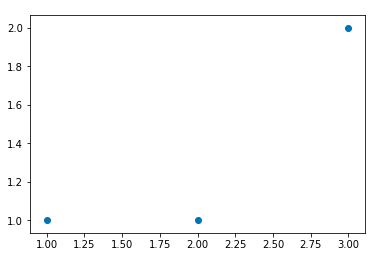
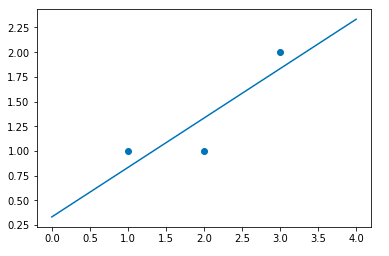
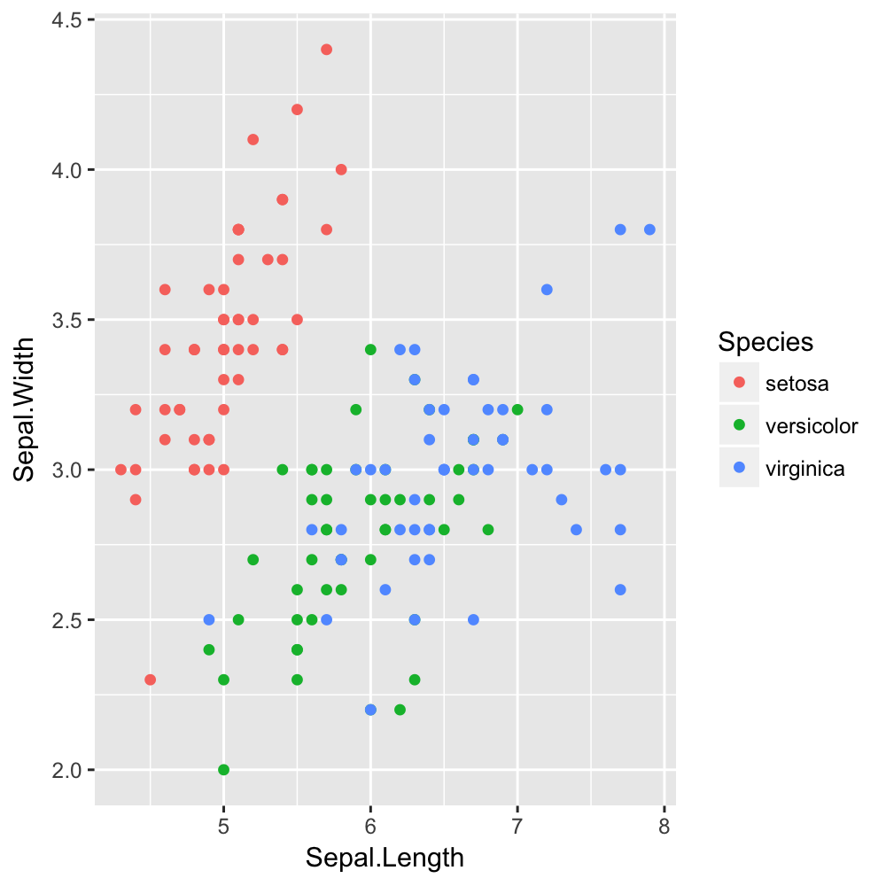

# 회귀

지금까지는 나이브베이스나 k-근접이웃같은 방법을 통해 주어진 데이터를 기반으로 새로운 데이터를 구별해냈습니다. 이들은 공통적으로 확률적, 그리고 결정적인 방법으로 새로운 데이터가 어느 항목에 더 밀접한지를 찾아내는 방법을 사용해왔습니다. 잠시 이러한 접근법을 미뤄두고, 이번에는 조금 다른 접근을 통해 분류법을 만들어보고자 합니다.

회귀를 가지고 분류를 할때는 주어진 데이터를 직접적으로 이용하지 않고, 데이터들의 패턴 분석을 우선적으로 합니다. 이러한 방법은 데이터의 특징과 항목 사이에 규칙을 알아낸다는 장점이 있고, 어떤 미지의 데이터를 주어주더라도 빠른 결과를 낼 수 있는 장점이 있습니다. 반면 데이터 사이에 명확한 관련성이나 패턴이 존재하지 않거나, 옳바르지 않은 패턴을 사용해 분석했을 경우 높은 오류율을 낼 수 있습니다. 분류과정이 빠른 만큼 정확한 분류 방식을 찾아내는게 더 어려운 방법입니다.

데이터를 기반으로 하는 분류법의 단점중 하나는 어떠한 형태로든 원본의 데이터 혹은 그 데이터에 대한 통계자료를 저장하고 있어야 한다는 것입니다. 이는 당연하게도 데이터의 량이 방대해질수록 분류법 또한 무거워진다는 단점이 있습니다. 회귀법은 많은 데이터를 하나의 모델로 추정하고, 그 모델이 최대한 데이터를 정확하게 반영하도록 설계하기때문에 훨씬 가볍습니다. 하시만 그만큼 모델을 찾아내고 설계하는 일이 복잡하고 어쩔때는 모델이 더 무거워질 수도 있습니다.

## 특징

| 장점 | 단점 |
|:---:|:---:|
|극한의 데이터에 대해 결과를 낼 수 있다. | 이상치에 대해 민감하게 반응한다  |

회귀(Regression)이란 기본적으로 특징-결과 사이에 규칙성, 혹은 관계를 찾아내는 과정입니다. 머신러닝 뿐만 아니라 다양한 분야에서 어떠한 데이터를 가지고 통계적인 모델링을 할때 사용되는 대표적인 방법입니다.

다음과 같은 그래프를 자주 볼 수 있습니다. 빨간색 점들은 2가지 다른 변수에 의해 나타낼 수 있는데 데이터를 표기한 것이고, 파란색 선은 이 두가지 변수 사이에 어떠한 관계를 나타내고 있습니다. 이러한 관계를 찾아낸다면, 우리는 수치형 값을 예측할 수 있는 강력한 도구를 가지게 되는 샘입니다. 이러한 '예측'이 주된 목적이 되기도 하지만, 또다른 의미는 과연 두가지 다른 변수가 얼마나 서로 밀접한 관계가 되어있는지를 판단하는 일입니다. 이는 데이터가 찾아낸 회귀 모델 주변에 얼마나 밀집되어있는지로 판단할 수 있습니다.

회귀법을 사용하는 방법은 크게 세가지로 나눠질 수 있습니다. 첫번째 단계는 모델링입니다. 이는 우리가 다루고있는 데이터들의 특징들 사이에 관계(relation)를 먼저 예측해보는 일입니다. 두번째 단계는 우리가 예측한 모델을 주어진 데이터를 가장 잘 나타내도록 맞추는 일입니다. 이 과정을 트레이닝(training), 피팅(fitting), 러닝(learning)등으로 불립니다. 마지막으로, 새로운 미지의 데이터를 우리가 만든 모델에 사용하는 일입니다.

## 회귀의 종류

회귀는 모델과 용도에 따라서 종류가 다양하게 변합니다. 데이터를 반영하는 모양에 따라 선형회귀, 다항회귀, 지수회귀 등으로 불리며, 데이터와 회귀모델 사이에 거리를 측정해 모델을 평가할수 있습니다. 회귀모델을 정했다면, 이 거리를 좁혀나가는 방식으로 최적화합니다. 물론 여러 모델을 동시에 선택해 어느 모델이 더 적합한지를 판단할 수도 있습니다.

먼저, 가장 기본적인 회귀법인 선형회귀를 살펴본 뒤, 머신러닝에 사용되는 로지스틱 회귀를 설명하겠습니다.

### 선형회귀

다음과 같은 데이터를 주어주고, 이 데이터에 가장 알맞는 선형 모델을 찾아보도록 하겠습니다.

|x|y|
|:--:|:--:|
|1   | 1  |
|2   | 1  |
|3   | 2  |

선형회귀는 다음과 같은 식을 가집니다.

$$
f(x)=ax+b
$$

그렇다면 우리는 a와 b를 조절해 위의 식이 데이터를 가장 잘 나타내도록 만들어야 합니다.

데이터 위치를 보면 세 점 모두를 하나의 선으로 나타낼 수는 없습니다. 그렇다면 과연 무엇을 기준으로 우리가 '최적합'한 선을 찾을 수 있을까요? 가장 직관적인 기준은 거리입니다. 세 점부터 선까지의 거리가 가장 짧을때 선이 가장 적합하다고 말할 수 있습니다.

선으로부터 세 점까지의 거리는 다음과 같이 나타낼 수 있습니다.

$$
\begin{aligned}
\text{dist}(x) &= |f(x) - y| \\
\text{dist}^2(x) &= \left(f(x)-y\right)^2
\end{aligned}
$$

거리는 단순히 선부터 점까지의 거리지만, 절대값을 구하는 과정을 제곱을 구하는 과정으로 대체할 수 있습니다. 거리를 최소화 하는 문제와 거리의 제곱을 최소화 하는 문제의 결과는 동일합니다.

$$
\begin{aligned}
    \vec{\text{dist}} &= (f(\vec{x})-\vec{y})^2\\
    &= \left(
    \begin{bmatrix}
            ax_1+b\\
            ax_2+b\\
            ax_3+b
    \end{bmatrix}
    -
    \begin{bmatrix}
            y_1\\
            y_2\\
            y_3
    \end{bmatrix}
    \right)^2 \\
    &= \left(
    \begin{bmatrix}
            1a+b\\
            2a+b\\
            3a+b
    \end{bmatrix}
    -
    \begin{bmatrix}
            1\\
            1\\
            2
    \end{bmatrix}
    \right)^2\\
    &= \begin{bmatrix}
    (a+b-1)^2 \\
    (2a+b-1)^2 \\
    (3a+b-2)^2
    \end{bmatrix}\\
    &= \begin{bmatrix}
    a^2 + 2 a b - 2 a + b^2 - 2 b + 1 \\
    4 a^2 + 4 a b - 4 a + b^2 - 2 b + 1 \\
    9 a^2 + 6 a b - 12 a + b^2 - 4 b + 4
    \end{bmatrix}
\end{aligned}
$$

총 거리의 합은 $14 a^2 + 12 a b - 18 a + 3b^2 - 8 b + 6$입니다. 이 식의 최소값은 $(a,b)=(\frac{1}{2},\frac{1}{3})$이기 때문에, 최적의 선형 회귀모델은

$$
y=\frac{1}{2}x + \frac{1}{3}
$$

과 같이 나타낼 수 있습니다.

### 로지스틱회귀 이론

회귀는 위와 같이 먼저 데이터를 표현해주는 식을 정한 뒤, 그 식에 데이터를 맞추는 방식으로 진행됩니다. 즉, 모든 회귀법은 모델링과 모델의 최적화 과정을 정하는걸로 시작합니다. 이 두가지를 어떻게 정하느나에 따라 회귀법을 다양한 방식으로 응용할 수 있습니다.

로지스틱 회귀의 모델은 선형회귀와 같이 선형식을 기반으로 합니다.

$$
y=ax+b
$$

하지만 이번에는 이 모델을 최적화하는 방법이 조금 다릅니다. 위와같이 선형모델을 데이터에 '최적합'하도록 만들고싶을때는 거리를 기준으로 가장 짧은 거리를 찾는식으로 진행했습니다. 하지만 이번에는 거리가 아닌 '분류'가 기준이 되야합니다. 이 선은 데이터의 모양을 나타내는 것이 아닌 데이터의 분류 기준이 됩니다.
